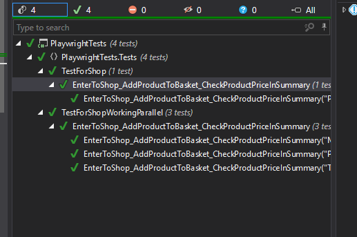

#EnterToPlaywright

This is an example of using Playwright in practice. In this example, I am using C# and Playwright.

This repository has two tests which are showing how we can write an automated test with Page Object. Also, this solution has an example of how to run tests in parallel.

## The tests consist of:
1) Entering the test store. 
2) Selecting a product of interest
3) Writing the current price to a variable value
4) Adding to the shopping cart
5) Moving to the shopping cart
6) Comparing whether the price from the product details agrees with the price on the summary.


Running tests:

``` dotnet test ```


or VS explorer (R# or VS)


